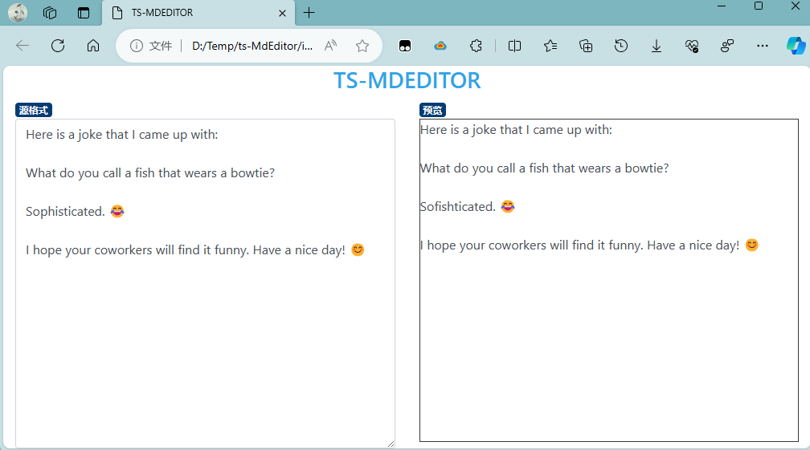

# ts-MdEditor
# 初始化
```bash
╰─❯ tsc --init

Created a new tsconfig.json with:
                                                                                                                     TS
  target: es2016
  module: commonjs
  strict: true
  esModuleInterop: true
  skipLibCheck: true
  forceConsistentCasingInFileNames: true
```

# 创建UI
Bootstrap CDN: https://www.bootstrapcdn.com/bootswatch/?theme=0
布局草图绘制: https://www.layoutit.com/build
Flex布局: https://getbootstrap.com/docs/4.1/utilities/flex/#grow-and-shrink

添加一个MarkdownParser.ts
创建这个类，是为了能够通过ID来获取文本区域和标签。
把实例对象绑定到Textarea，处理keyup事件。触发该事件时，就检查文本区域中是否有文本。
如果有，就使用这些文本设置标签Label的innerHTML。
